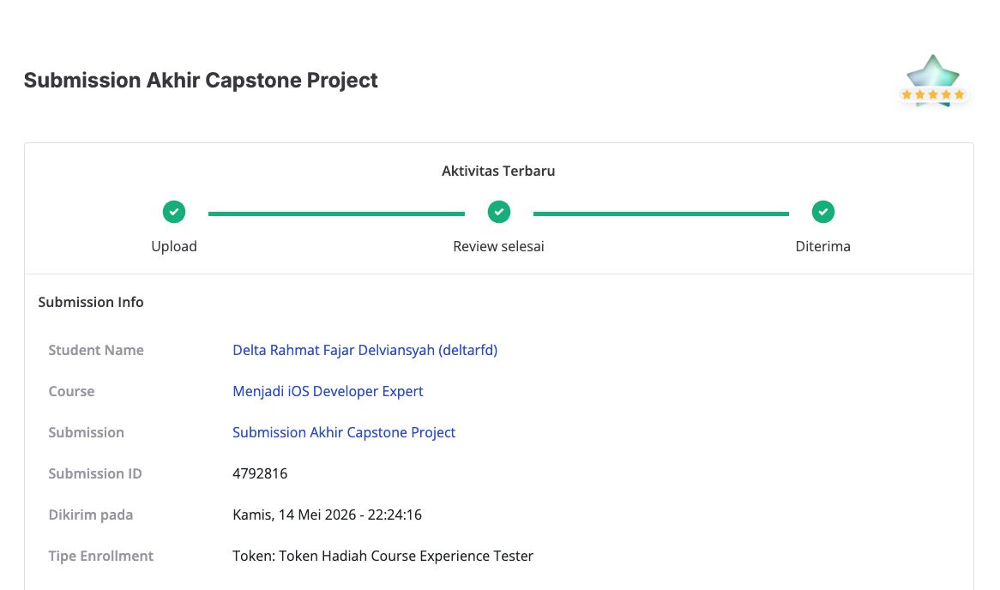
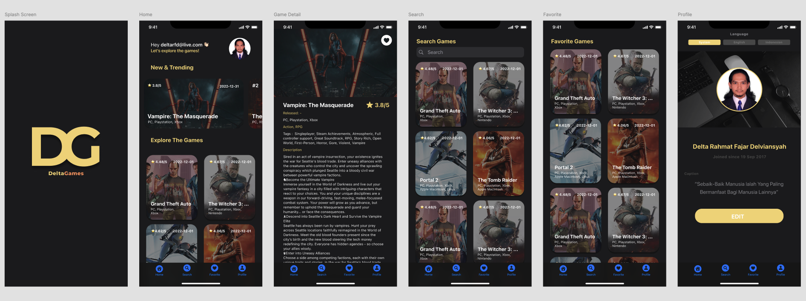
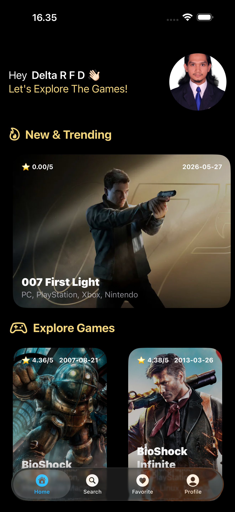
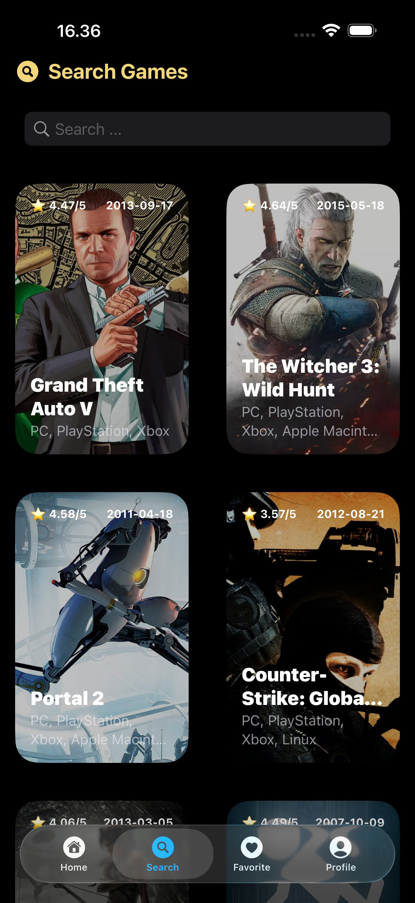
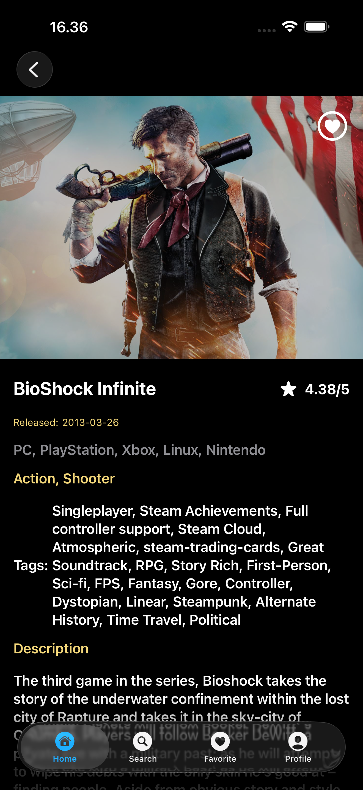
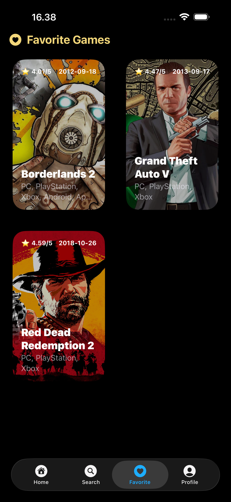
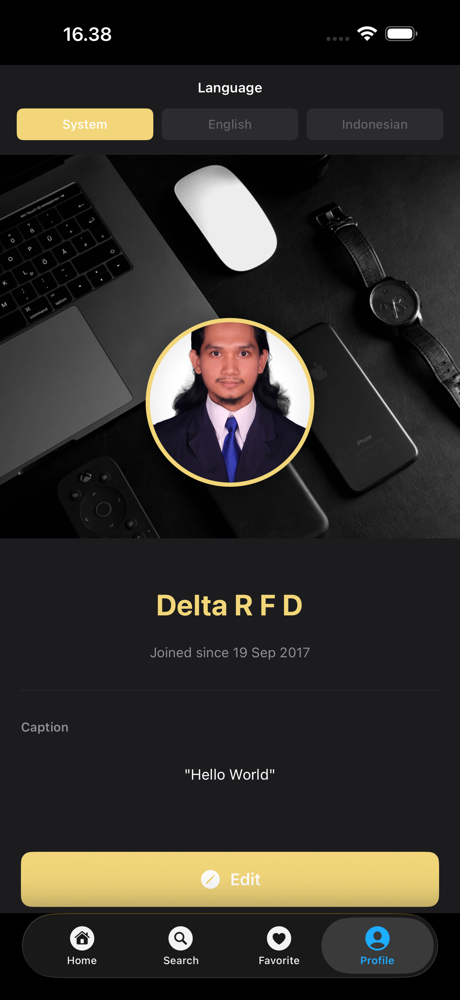

# DeltaGames iOS

[](https://github.com/deltarfd/DeltaGamesiOS/actions/workflows/ios-ci.yml)
[](https://github.com/deltarfd/DeltaGamesiOS/actions/workflows/security-and-deps.yml)

DeltaGames is a modern iOS game discovery application built with SwiftUI and powered by the RAWG API. This repository showcases a clean, modular architecture with clear separation between presentation, domain, data, and persistence layers, plus reusable feature modules for Home, Detail, Favorite, Search, and Profile. It is designed as both a production-ready app foundation and a learning reference for scalable iOS development, including unit tests, CI automation, linting, and secure API key handling.


## Submission Result



## Course Certificate

- https://www.dicoding.com/certificates/98XW08R44XM3

## Prototype

[](https://www.figma.com/design/NnC0lsVvTqmuX5Ikvbmuor/Delta-Games---DICODING-2026-Updated?node-id=0-1&t=HlXVOVsqxpOlRHch-1)

[View Wireframe Design](https://www.figma.com/design/NnC0lsVvTqmuX5Ikvbmuor/Delta-Games---DICODING-2026-Updated?node-id=0-1&t=HlXVOVsqxpOlRHch-1)



## Screenshots

<table>
  <tr>
    <td align="center" width="50%"><br/><sub>Home</sub></td>
    <td align="center" width="50%"><br/><sub>Search</sub></td>
  </tr>
  <tr>
    <td align="center"><br/><sub>Detail</sub></td>
    <td align="center"><br/><sub>Favorite</sub></td>
  </tr>
  <tr>
    <td align="center" colspan="2"><br/><sub>Profile</sub></td>
  </tr>
</table>
## App Overview

- Discover games from the RAWG API with a fast, clean SwiftUI experience.
- Browse game lists on the Home page and search titles by keyword.
- Open a detail page to see game information and supporting visuals.
- Save favorites for quick access later.
- View developer/profile information in the Profile page.

## API Key Configuration

The RAWG API key is managed securely through environment variables:

- **For CI/CD (main repo)**: Set `RAWG_API_KEY` secret in GitHub Actions or `RAWG_API_KEY` in Codemagic for full coverage data.
- **For Fork PRs**: CI automatically uses a non-secret fallback key; build/tests run without external API data.
- **For Local Development**: Set `RAWG_API_KEY` env variable or update `RawgAPI.plist`

## Build Locally

### 1) Install dependencies

```bash
pod install --repo-update
```

### 2) Build app

```bash
xcodebuild \
  -workspace DeltaGames.xcworkspace \
  -scheme DeltaGames \
  -destination 'generic/platform=iOS Simulator' \
  -configuration Debug \
  clean build
```

### 3) Run lint

```bash
./Pods/SwiftLint/swiftlint lint --config .swiftlint.yml DeltaGames
```

## Repository Structure

- `DeltaGames/`: Main iOS application.
- `Modules/CoreCommon/`: Common reusable module (generic protocols + localization + tests).
- `Modules/Features/`: Feature framework modules (Home, Detail, Favorite, Search, Profile).
- `.github/workflows/`: CI and security automation.
- `codemagic.yaml`: Codemagic build pipeline.
